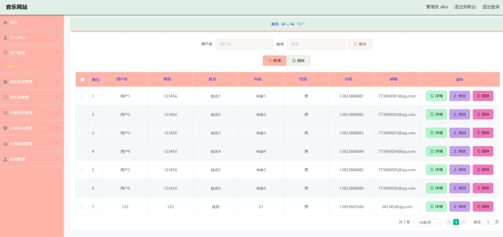
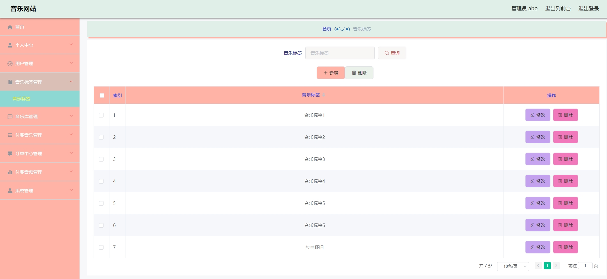
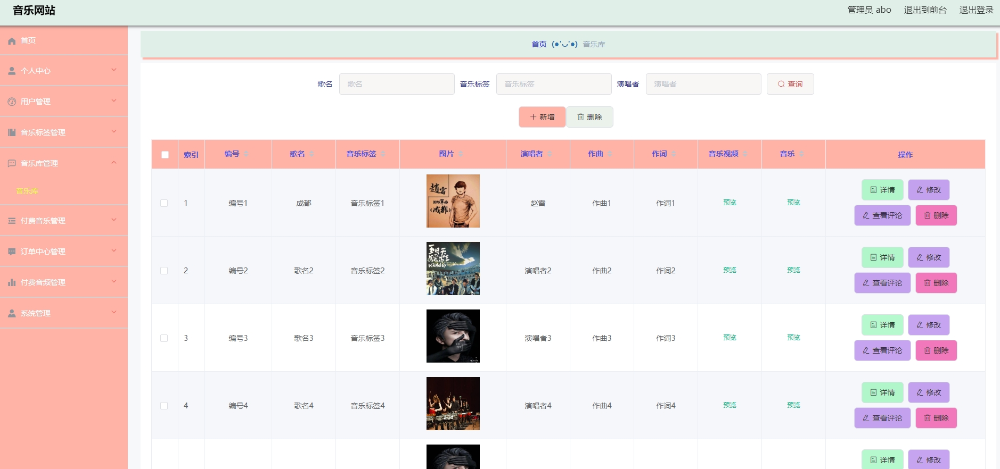
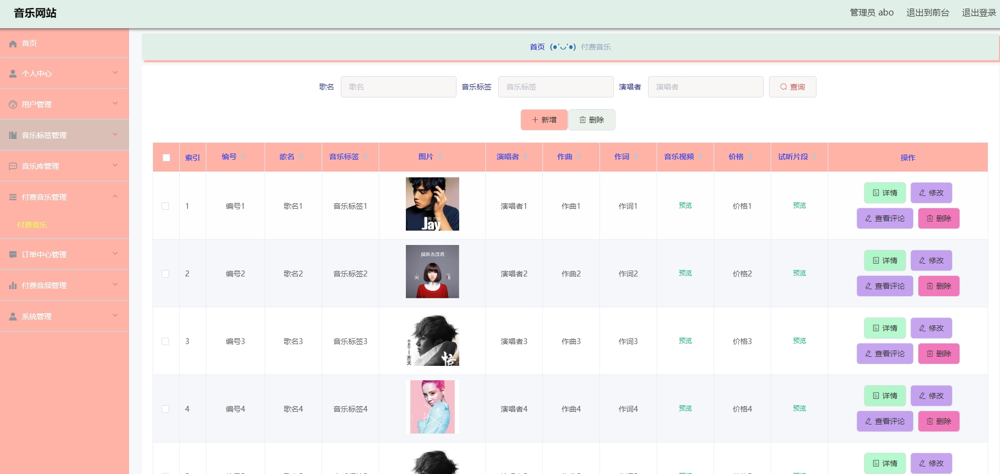
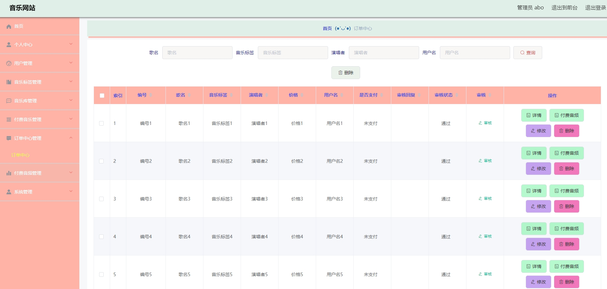
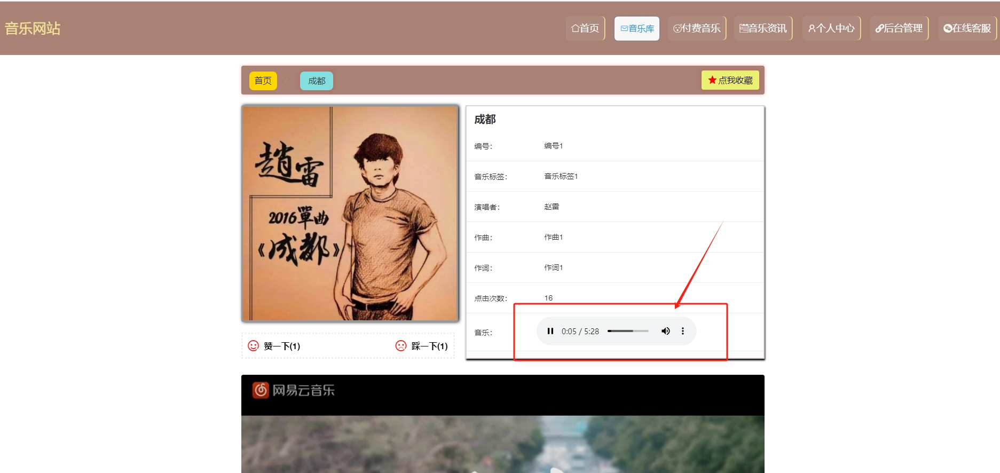
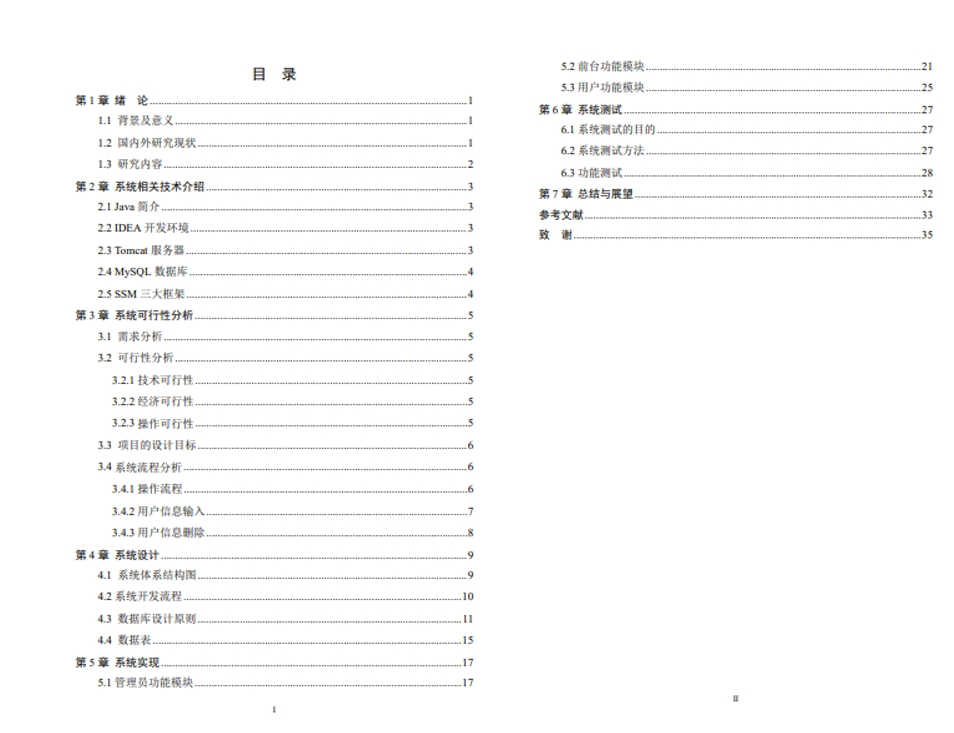

# 1.项目介绍
- 系统角色：管理员、普通用户
- 功能模块：管理员（用户管理、音乐标签管理、付费音乐管理、订单管理、付费音频管理、系统管理等）、普通用户（个人中心、订单中心、付费音乐、收藏管理等）
- 技术栈：SSM，vue，layui等
- 测试环境：idea2024，Maven3，MySQL5.7，jdk1.8
# 2.项目部署
- 创建数据库，导入sql
- 通过idea打开文件ssm，并根据本地数据库环境修改src/main/resources/config.properties 3-5行
- 配置tomcat，启动
- 后端管理web：http://localhost:8080/ssmj1207/admin/dist/index.html 管理员账号密码：abo/abo ，普通用户自行查表
- 门户：http://localhost:8080/ssmj1207/front/index.html
# 3.项目部分截图

# 4.获取方式
[戳我查看](https://gitee.com/aven999/mall)